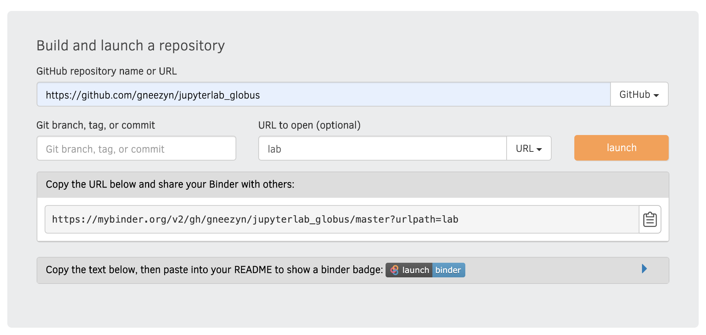

# MyBinderHub Registration Example
This document assumes that you have already navigated to the [MyBinderHub Registration Page](https://mybinder.org).

In the image above, the following changes should be made:
* `<username>` should be replaced by your github username
* `<repo>` should be replaced by the name of the repo (in this case, likely `jupyterlab_globus`)
* If you do not want to use the `master` branch then you should specify a different branch in appropriate field
* Once everything has been filled, press the `Launch` button and wait as MyBinderHub builds the repo (this can take a while)

The following examples use this GitHub repository:

### Master Branch Example

### Other Branch Example
